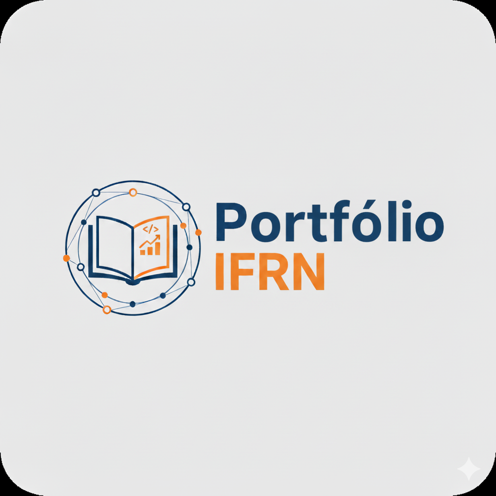

# Portfólio IFRN

O sistema em questão possui dois objetivos principais, em torno de um mesmo princípio - ofertar aos alunos de TADS/IFRN oportunidades de estágio e/ou trabalho. Por um lado, permitirá que os alunos possam publicar os seus portfólios de projetos de desenvolvimento de software e as experiências acumuladas na participação dos mesmos. Por outro lado, permitirá que empresas/instituições, devidamente autorizadas, a publicar oportunidades de vagas e receba informações dos respectivos interessados.

# Equipe e Formas de Contato

1. prof. Fellipe Aleixo - @fellipealeixo
2. Alunos(as) da turma de APOO no semestre de 2025.2

# Horário de Reuniões

As sessões de desenvolvimento acontecerão durante as aulas da disciplina de APOO, no semestre de 2025.2 - terças-feiras, das 16h30 às 18h e quintas-feiras, das 14h30 às 16h.

# Documentação

[Link para os documentos do projeto](doc/documentacao.md)

# Manual da Desenvolvedor

[Orientações para os desenvolvedores do projeto](doc/guia-ds/guia.md)
