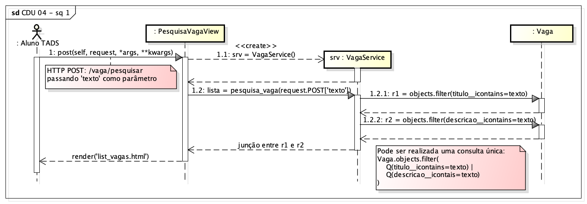
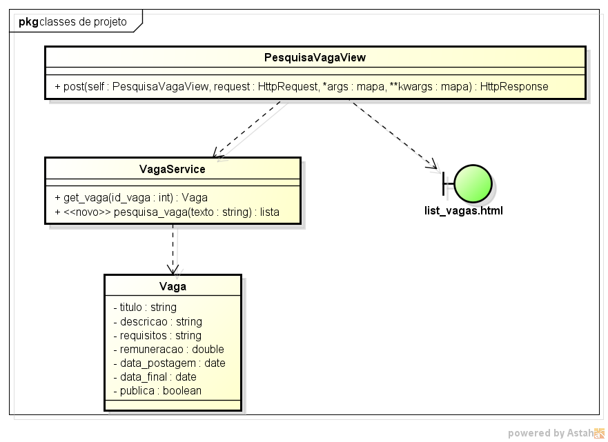

# CDU 04. Pesquisar por vagas específicas

- **Ator principal**: Aluno TADS.
- **Atores secundários**: não possui.	 
- **Resumo**: Um aluno de TADS interessado em uma oportunidade de prática profissional, digita um fragmento de texto (em um formulário de pesquisa) e busca por vagas cadastradas que possuam o referido texto no seu título ou descrição. Como resultado, são apresentadas as vagas que correspondam ao critério de busca.
- **Pré-condição**: Usuário logado.
- **Pós-Condição**: Apresentação da lista de vagas que satisfazem o referido critério.

## Fluxo Principal
| Ações do ator | Ações do sistema |
| :-----------: | :--------------: | 
| 1 - Na página principal do sistema, o aluno (logado) preenche um campo de pesquisa e clica em "pesquisar". | |  
| | 2 - O sistema realiza uma busca pelo fragmento de texto e apresenta uma lista com as vagas que satisfazem o referido critério. | 

## Fluxo Alternativo I - Campo de pesquisa não preenchido
| Ações do ator | Ações do sistema |
| :-----------: | :--------------: |   
| | 2.1 - O sistema torna a apresentar a página principal do sistema, com uma mensagem de erro, indicando que o campo de busca precisa ser preenchido. |

## Fluxo Alternativo II - Nenhum resultado satisfaz o critério
| Ações do ator | Ações do sistema |
| :-----------: | :--------------: | 
| | 2.2 - O sistema torna a apresentar a página principal do sistema, com uma mensagem de erro, indicando que nenhuma vaga foi encontrada satisfazendo os critérios informados. |  

## Diagrama de Interação (Sequência ou Comunicação)

## Diagrama de Classes de Projeto

