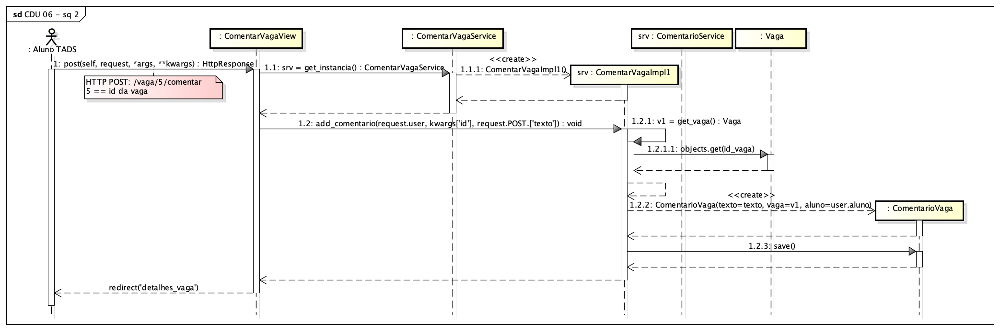
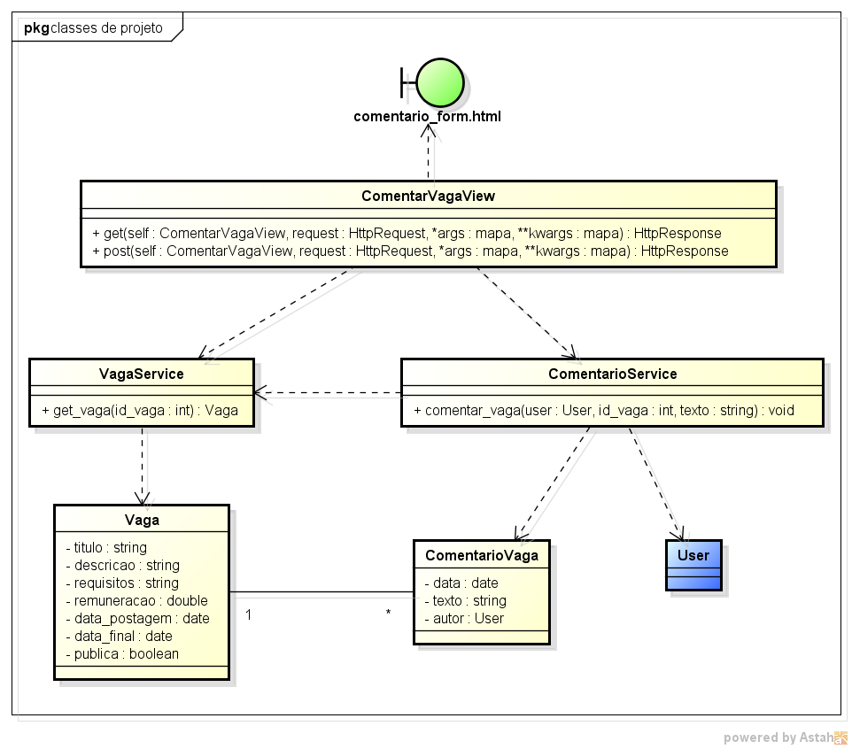

# CDU 06. Comentar em vaga ou portifólio

- **Ator principal**: Aluno TADS
- **Atores secundários**: não possui	 
- **Resumo**: Ao visualizar os detalhes de uma dada vaga (ou portfólio) o aluno decide deixar um comentário, clicando na ação correspondente. O sistema exibe um formulário para que seja digitada o comentário, o qual é preenchido e enviado. Por fim, acontece um redirecionamento para a visualização da vaga.
- **Pré-condição**: A vaga edvidamente cadastrada e aluno deve estar logado.
- **Pós-Condição**: Um novo comentário associado à vaga é persistido.

## Fluxo Principal
| Ações do ator | Ações do sistema |
| :-----------: | :--------------: | 
| O - Na visualização dos detalhes de uma vaga o aluno clica na ação de deixar comentário. | |  
| | 1 - O sistema exibe um formulário para o cadastramento do comentário (texto, automáticos - autor e data/hora). |
| 2 - O aluno preenche e submete o comentário. | |
| | 3 - O comentário é persistido (relacionado ao aluno e à vaga). Por fim, redireciona para a visualização dos detalhes da vaga. |

## Fluxo Alternativo I - Comentar portfólio
| Ações do ator | Ações do sistema |
| :-----------: | :--------------: | 
| O.1 - Na visualização dos detalhes de um portifólio o aluno clica na ação de deixar comentário. | |  
| | 1.1 - O sistema exibe um formulário para o cadastramento do comentário (texto, automáticos - autor e data/hora). |
| 2.1 - O aluno preenche e submete o comentário. | |
| | 3.1 - O comentário é persistido (relacionado ao aluno e ao portifólio). Por fim, redireciona para a visualização dos detalhes do portifólio. |

## Fluxo Alternativo II - Comentário vazio
| Ações do ator | Ações do sistema |
| :-----------: | :--------------: | 
| | 3.2 - O formulário de preenchimento do comentário é exibido novamente, com uma mensagem de erro de dados inválidos. |
| (retorna ao passo 2 do fluxo principal) | |

## Fluxo Alternativo III - Referência a uma vaga inexistente
| Ações do ator | Ações do sistema |
| :-----------: | :--------------: | 
| | 1.3 - O sisema apresenta a página principal, com uma mensagem de identificador de vaga inválido. |

## Diagrama de Interação (Sequência ou Comunicação)

### Parte 1 do Diagrama de Sequência

### Parte 2 do Diagrama de Sequência

## Diagrama de Classes de Projeto

