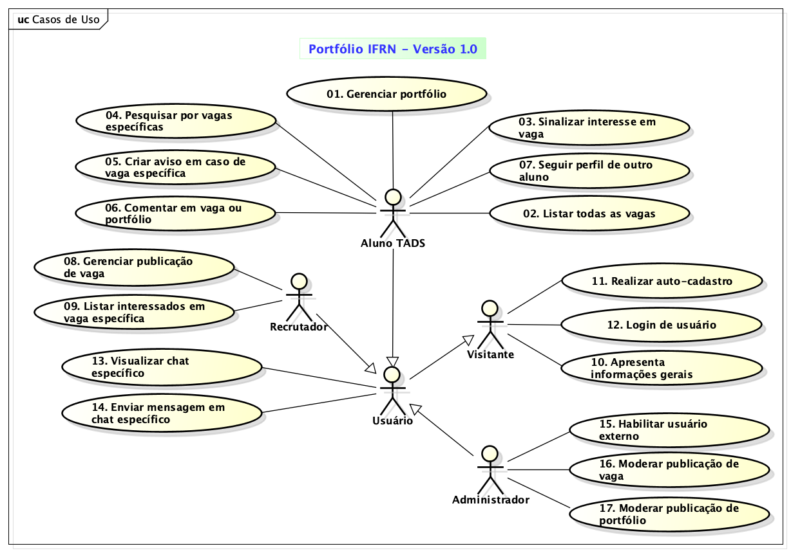

# Modelo de Casos de Uso

## Histórico de Revisões

| Data | Versão | Descrição | Autores |
| :--: | :----: | :-------: | :-----: |
| 02/10/25 | 0.1 | Versão inicial do diagrama ed CDU | Fellipe Aleixo |
| 07/10/25 | 1.0 | Complemento e fechamento da versão inicial |  Fellipe Aleixo |
| - | - | - | - | 

## 1. Diagrama de Casos de Uso

## 2. Listagem dos Detalhamentos dos Casos de Uso

1. [CDU-01 - Gerenciar portfólio](./cdu-01/detalhamento-01.md)
1. [CDU-02 - Listar todas as vagas](./cdu-02/detalhamento-02.md)
1. [CDU-03 - Sinalizar interesse em vaga](./cdu-03/detalhamento-03.md)
1. [CDU-04 - Pesquisar por vagas específicas](./cdu-04/detalhamento-04.md)
1. [CDU-05 - Criar aviso em caso de vaga específica](./cdu-05/detalhamento-05.md)
1. [CDU-06 - Comentar em vaga ou portifólio](./cdu-06/detalhamento-06.md)
1. [CDU-07 - Seguir perfil de outro aluno](./cdu-07/detalhamento-07.md)
1. [CDU-08 - Gerenciar publicação de vaga](./cdu-08/detalhamento-08.md)
1. [CDU-09 - Listar interessados em vagas específicas](./cdu-09/detalhamento-09.md)
1. [CDU-10 - Apresenta informações gerais do sistema](./cdu-10/detalhamento-10.md)
1. [CDU-11 - Realiza auto-cadastro](./cdu-11/detalhamento-11.md)
1. [CDU-12 - Login de usuário](./cdu-12/detalhamento-12.md)
1. [CDU-13 - Visualizar chat específico](./cdu-13/detalhamento-13.md)
1. [CDU-14 - Enviar mensagem em chat específico](./cdu-14/detalhamento-14.md)
1. [CDU-15 - Habilitar usuário externo](./cdu-15/detalhamento-15.md)
1. [CDU-16 - Moderar publicação de vaga](./cdu-16/detalhamento-16.md)
1. [CDU-17 - Moderar publicação de portfólio](./cdu-17/detalhamento-17.md)
