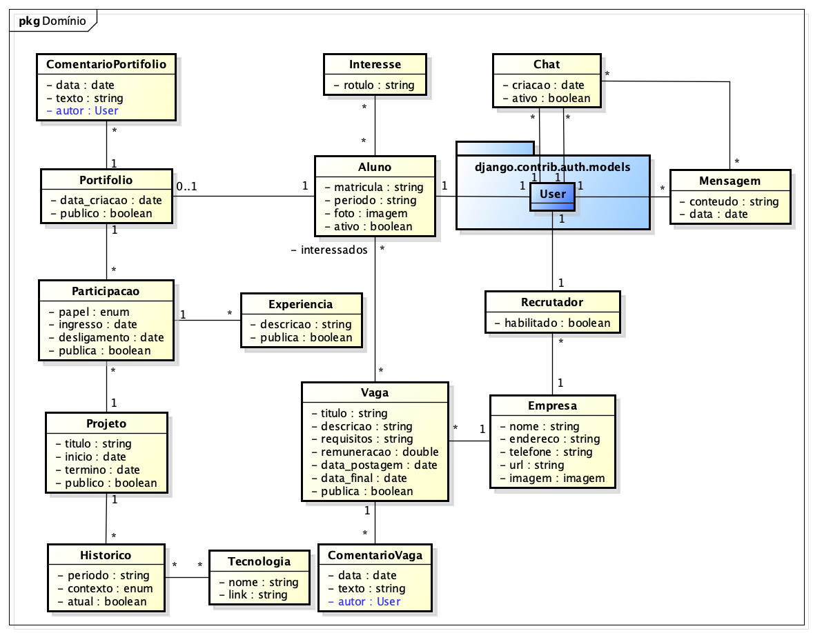

# Modelo de Domínio

## Histórico de Revisões

| Data | Versão | Descrição | Autores |
| :--: | :----: | :-------: | :-----: |
| 04/12/2025 | 1.0 | Versão inicial |  Fellipe Aleixo |
| - | - | - |  - |

## 1. Diagrama das Classes Conceituais do Domínio

## 2. Glossário (sugestão)

| Termo | Explicação |
| :---: | :--------: |
| Portifolio | Conjunto das experiências anteriores de um dado aluno, demostrando as capacidades desenvolvidas pelo mesmo no decorrer do seu curso superior. |
| Historico | Representação do contexto de um projeto em um dado semestre (qual o PDS). |
| Tecnologia | Tecnologias de software aplicadas ao desenvolvimento de um dado projeto. |
| Interesse | Indicação dos pontos fortes do aluno, segundo a sua avaliação (front-end, back-end, análise, etc.). |
